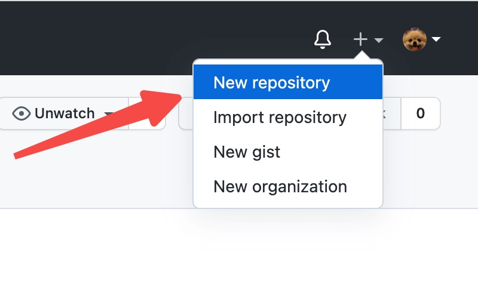
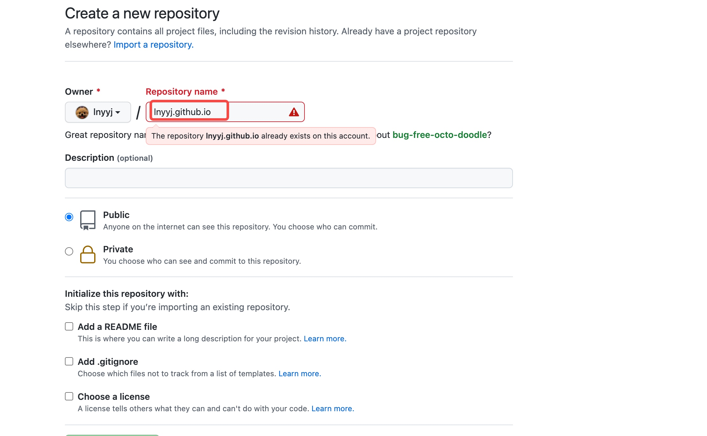
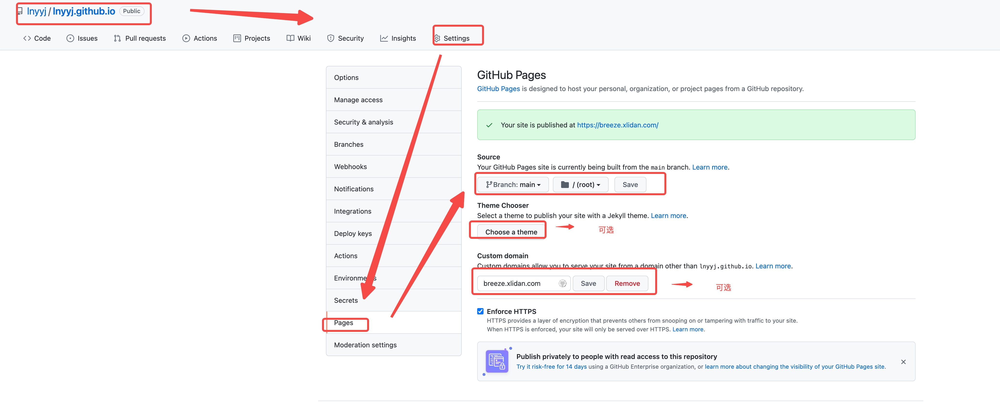

# github pages 博客搭建
    - 官网教程: https://pages.github.com/
    
## 步骤
- 1. 点击创建一个仓库


- 2. 输入repository name，格式 *.github.io，注意这里的 * 是指username名，username和图中的 owner一定要保证一致. 不然 *.github.io无法直接访问。



- 3. 配置pages， 这里主要设置访问的分支。 主题和域名是可选项。



```
 echo "Hello World" > index.html
 
 然后添加index.html到工程里（记得push）
```

- 4. 经过上面的步骤就可以访问了自己的博客了。 例如我的博客 lnyyj.github.io
- 5. theme的选择, 可以选择默认的，也可以在github上下载别人的，有很多。 我就是下载别人的

##  mweb 发布
