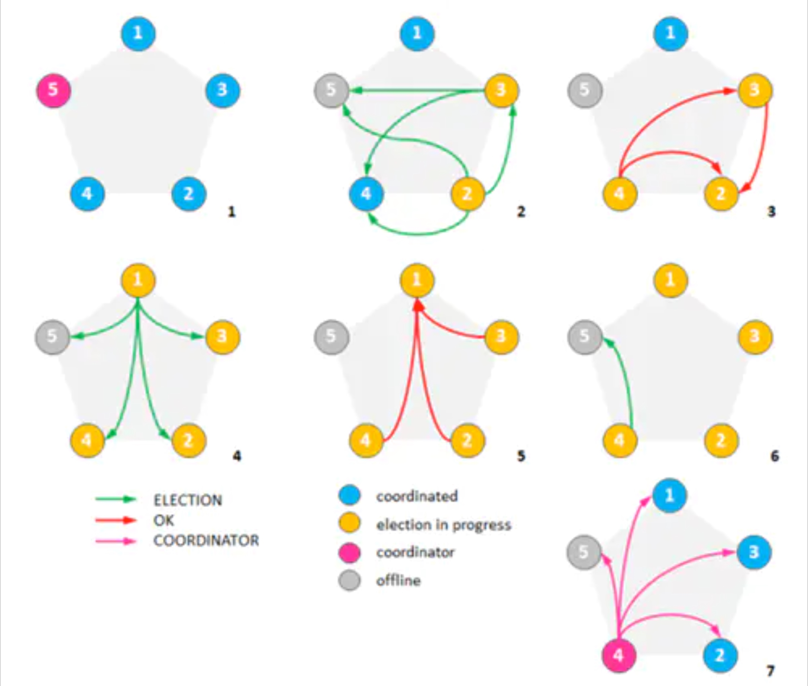

# mongo

    
## 副本集简介
Mongodb副本集由一组Mongod实例（进程）组成，包含一个Primary节点和多个Secondary节点，Mongodb Driver（客户端）的所有数据都写入Primary，Secondary从Primary同步写入的数据，以保持复制集内所有成员存储相同的数据集，提供数据的高可用。副本集带来的架构优点主要有：

- 集群高可用
- 读写可分离

## 副本集节点类型
- **Primary**: 副本集的主节点，可读写，唯一可以进行写操作的节点，由集群自行选举出来。
- **Secondary**： 正常情况下，Seconary会参与Primary选举（自身也可能会被选为Primary），并从Primary同步最新写入的数据，以保证与Primary存储相同的数据。Secondary可以提供读服务，增加Secondary节点可以提供副本集的读服务能力，提升副本集的可用性。
- **Arbiter**： Arbiter节点只参与投票，不能被选为Primary，并且不从Primary同步数据。非常轻量级的服务，当复制集成员为偶数时，最好加入一个Arbiter节点，以提升复制集可用性。
- **Priority0**： Priority0节点的选举优先级为0，不会被选举为Primary，且不能发起选举。
- **Vote0**： 副本集成员最多50个，参与Primary选举投票的成员最多7个，其他成员（Vote0）的vote属性必须设置为0，即不参与投票。
- **Hidden**： Hidden节点不能被选为主（Priority为0），并且对Driver不可见。因Hidden节点不会接受Driver的请求，可使用Hidden节点做一些数据备份、离线计算的任务，不会影响复制集的服务。
- **Delayed**： Delayed节点必须是Hidden节点，并且其数据落后与Primary一段时间（可配置，比如1个小时）。因Delayed节点的数据比Primary落后一段时间，当错误或者无效的数据写入Primary时，可通过Delayed节点来做数据恢复。

## Primary选举
选举过程需要消耗一些时间，在此期间，集群将不能接收write操作（即使旧的primary仍然存活，但因为“网络分区”问题导致它不能与其他secondaries通讯），所有的members（包括旧的primary）都处于只读状态，选举对业务影响很大，所以需要尽量避免选举的发生。

需要进行Primary选举的场景：

- 副本集初始化时；
- 副本集被reconfig；
- Secondary节点检测到Primary宕机时；
- 当有Primary节点主动stepDown（主动降级为Secondary）时；

### Primary的选举受节点间心跳、优先级、最新的oplog时间等多种因素影响。

- **心跳**： 复制集中的所有members之间都互相建立心跳连接，且每隔两秒发送一次心跳，如果未在10秒内收到回复，则此member将会被标记为“不可用”，Secondary（前提是可被选为Primary）会发起新的Primary选举，而其他能正常收到心跳反馈的Secondary能否决新的Primary选举。
- **优先级**： 优先级即Priority值，每个member都有权重值，默认为都为1，members倾向于选举权重最高者。上述提到，priority为0的member不能被选举为primary且不能发起选举；只要当前primary的权重最高或者持有最新oplog数据的secondaries没有比它更高的权重时，集群不会触发选举。当Primary发现有优先级更高Secondary，并且该Secondary的数据落后在10s内，则Primary会主动降级，让优先级更高的Secondary有成为Primary的机会。
- **Optime**： 当前member已经从primary的oplog中应用的最后一个operation的时间戳（此时间戳由primary生成，在oplog中每个操作记录都有）；一个member能成为primary的首要条件就是在所有有效的members中它持有最新的optime。
- **多数派连接**： 一个member要成为primary，它必须与“多数派”的其他members建立连接，如果未能与足够多的member建立连接，事实上它本身也无法被选举为primary；多数派参考的是“总票数”，而不是member的个数，因为我们可以给每个member设定不同的“票数”。假设复制集内投票成员数量为N，则大多数为 N/2 + 1。

综上所述，在发起选举以后，能成为Primary的节点需要的条件有：

- 能够与“多数派”建立连接
- 在所有有效的members中它持有最新的optime
- 前两个条件相同的，Priority优先级高的成为Primary
- optime与Priority都相等时，谁发起选举，谁当选Primary

### Primary 选举bully算法（mongo3.2之前使用算法）
#### Bully算法

**Bully算法**是一种相对简单的协调者竞选算法。算法的主要思想是集群的每个成员都可以声明它是协调者并通知其他节点。别的节点可以选择接受这个声称或是拒绝并进入协调者竞争。被其他所有节点接受的节点才能成为协调者。节点按照一些属性来判断谁应该胜出。

Bully算法中有三类消息：

- Election Message：宣布发起选举
- Answer Message：响应选举消息
- Victory Message：由选举胜利者发送，宣布胜利

当一个节点从故障中恢复或者监测到主节点故障时，执行过程如下：

- 如果该节点具有最高ID，则向其他节点发送Victory Message，成为主节点并结束选举，否则向所有编号比它大的节点发送Election Message；
- 如果该节点规定时间内没有收到答复，则向其他节点发送Victory Message，成为主节点并结束选举；
- 如果有ID比该节点大的节点响应，则等待Victory Message（如果一定时间后仍未收到Victory Message，则重新发起选举）
- 如果一个节点收到较低ID发来的Election Message，它将发送一个Answer Message，并发送Election Message到更高ID的节点开始选举。
- 如果一个节点收到Victory Message，则将发送者视为主节点。

####  举例

**下面是Bully算法选举过程的一个经典例子：**

1，最初集群中有5个节点，节点5是一个公认的协调者
2，如果节点5挂了，并且节点2和节点3同时发现了这一情况。两个节点开始竞选并发送竞选消息给ID更大的节点。
3，节点4淘汰了节点2和3，节点3淘汰了节点2
4，这时候节点1察觉了节点5失效并向所有ID更大的节点发送了竞选信息
5，节点2、3和4都淘汰了节点1
6，节点4发送竞选信息给节点5
7，节点5没有响应，所以节点4宣布自己当选并向其他节点通告了这一消息

#### 算法应用

MongoDB在实现时对Bully算法做了一些调整：

- Bully ID对应MongoDB节点的priority，且两个节点priority可能相等
- Secondary发现集群中没有Primary后不止向更高priority节点，而是向所有节点发送选举
- 收到选举请求的节点发现候选节点中有更高priority节点时投veto票，每个veto会将得票数-10000
- MongoDB没有vote权限的节点才能投票
- 发起选举过程中的节点不会投票
- 选举发起和投票过程中包含复杂的条件判断，但不影响协议理解
- 通过审核的节点会投vote票，每个vote会将得票数+1
- 最终得票数超过集群可投票节点数一半时通过选举，发起节点成为Primary。
- 当得票不足一半时，发起者随机退让，随机sleep 0 到1 秒后重新发起选举。
- 引入30s的“选举锁”，在持有锁的时间内不得给其他发起者投票，避免一个节点同时给两个发起者投票。
- 如果新选举出的主节点立马挂掉,至少需要30s时间重新选主。

### Primary 选举raft算法（mongo3.2之后使用算法）

## 总结
3.0版本以后副本集成员最多50个，参与Primary选举投票的成员最多7个，其他成员（Vote0）的vote属性必须设置为0，即不参与投票。

副本集中各类角色的特点总结如下：

| 节点类型 | 可读 |	可写|投票|oplog操作|当选Primary|否决|备注|
| :----: |:----:  |	:----: |:----: |:----: |:----: |:----: |:----: |
|Primary|	O	|O|	O|	生成|	—|	O|	无|
|Secondary	|O	|X	|O	|同步	|O	|O	|常规的Secondary|
|Priority=0|	O|	X|	O|	同步|	X|	O|	无|
|Hidden	|X	|X	|O	|同步	|X	|O	|Priority=0，不可见|
|Delayed	|X|	X|	O|	同步|	X|	O|	为Hidden，延迟同步|
|Arbiter	|X|	X|	O|	X|	X|	O|	Priority=0，无数据|
|vote=0	|O	|X|	X|	同步|	O|	O|	不能投票|

备注：
- 上述Secondary为默认Secondary，即Priority！=0、vote！=0等；
Hidden为特殊的Secondary，Delayed为特殊的Hidden

## oplog同步慢
https://developer.aliyun.com/article/47336

## 参考资料

engin介绍: https://www.sohu.com/a/314591047_610509
复制详解: https://mongoing.com/archives/72571
mongo中文文档-选择权限:   https://mongodb.net.cn/manual/core/replica-set-priority-0-member/
选举: https://www.jianshu.com/p/ea87058deafd