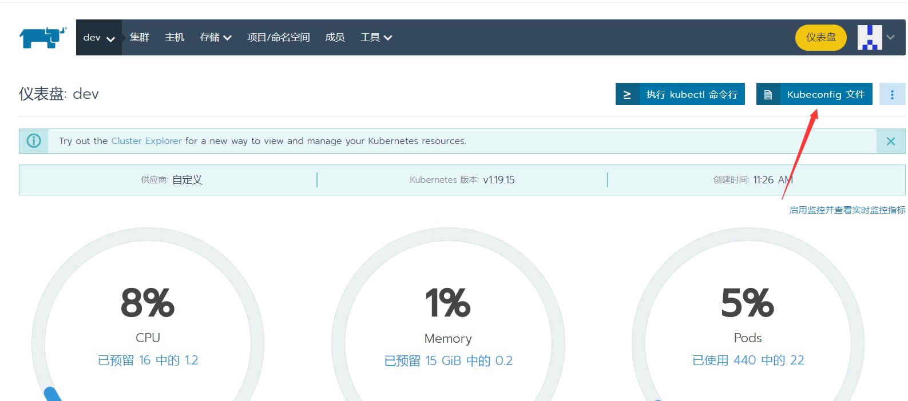

# Rancher部署
- Rancher是一个开源的企业级容器管理平台。通过Rancher，企业再也不必自己使用一系列的开源软件去从头搭建容器服务平台。Rancher提供了在生产环境中使用的管理Docker和Kubernetes的全栈化容器部署与管理平台。

首先所有节点部署docker

## 安装docker

### 安装docker依赖
- yum install wget expect vim net-tools ntp bash-completion ipvsadm ipset jq iptables conntrack sysstat libseccomp conntrack ipvsadm ipset jq iptables curl sysstat libseccomp wget vim net-tools git yum-utils device-mapper-persistent-data lvm2 -y

yum-config-manager --add-repo https://mirrors.aliyun.com/docker-ce/linux/centos/docker-ce.repo

dnf repo-pkgs docker-ce-stable list

yum list docker-ce --showduplicates | sort -r #查看docker的版本

yum -y install docker-ce-19.03.9-3.el7 #例如安装19.03.9版本

yum -y erase podman buildah #centos8需要删除podman
yum install docker-ce -y #安装最新版docker
或
yum install -y docker-ce-19.03.9-3.el7
yum install -y docker-ce-20.10.9-3.el7

mkdir -p /etc/docker
tee /etc/docker/daemon.json <<-'EOF'
{
"registry-mirrors": ["https://hz965f9u.mirror.aliyuncs.com"],
"exec-opts":["native.cgroupdriver=systemd"]
}
EOF

启动docker

systemctl daemon-reload ; systemctl restart docker;systemctl enable --now docker.service

docker version

docker info

## 关闭防火墙
systemctl status firewalld #查看防火墙状态
systemctl stop firewalld #临时关闭防火墙
systemctl disable firewalld #关闭防火墙开机自启
systemctl enable firewalld #开启防火墙自启


## 配置时间同步
确认时间服务已经安装

yum -y install chrony

vim /etc/chrony.conf

cat > /etc/chrony.conf <<-'EOF'
pool 172.20.92.66 iburst
driftfile /var/lib/chrony/drift
makestep 1.0 3
rtcsync
allow 172.20.92.0/24
local stratum 10
keyfile /etc/chrony.keys
leapsectz right/UTC
logdir /var/log/chrony
EOF

启动时间服务:
systemctl restart chronyd.service --now

设置完时区后，强制同步下系统时钟： chronyc -a makestep

查看时间同步源： chronyc sources -v

查看时间同步源状态： chronyc sourcestats -v

重启依赖于系统时间的服务

systemctl restart rsyslog ; systemctl restart crond

## 系统日志保存方式

原因：centos7以后，引导方式改为了systemd，所以会有两个日志系统同时工作只保留一个日志（journald）的方法 设置rsyslogd 和 systemd journald

持久化保存日志的目录
mkdir /var/log/journal
mkdir /etc/systemd/journald.conf.d

cat  >  /etc/systemd/journald.conf.d/99-prophet.conf <<-'EOF'
[Journal]
#持久化保存到磁盘
Storage=persistent
# 压缩历史日志
Compress=yes
SyncIntervalSec=5m
RateLimitInterval=30s
RateLimitBurst=1000
# 最大占用空间10G
SystemMaxUse=10G
# 单日志文件最大200M
SystemMaxFileSize=200M
# 日志保存时间 2 周
MaxRetentionSec=4week
# 不将日志转发到 syslog
ForwardToSyslog=no
EOF
#重启journald配置
systemctl restart systemd-journald

设置主机名
主机ip与域名的对应关系 设置主机名

cat > /etc/hosts <<-'EOF'
127.0.0.1 localhost localhost.localdomain localhost4 localhost4.localdomain4
::1 localhost localhost.localdomain localhost6 localhost6.localdomain6
172.20.92.66 rancher
172.20.92.66 k8s-master-01
172.20.92.67 k8s-node-02
172.20.92.68 k8s-node-03
EOF

关闭防火墙 SELinux 与swap交换空间
并关闭swap三台主机 并安装docker 本例安装版本为docker-ce-19.03.9-3.el7 设置好时间服务器

sed -ri 's/.swap./#&/' /etc/fstab

下载runcher
https://hub.docker.com/ rancher

在master端执行如下命令

docker pull rancher/rancher:v2.5.12-linux-amd64

dockerhub 点击overview进入官方站点

运行rancher
docker run -d --privileged -p 80:80 -p 443:443 --restart=always --name rancher-v2.5.12 rancher/rancher:v2.5.12-linux-amd64

或者以下这样

```
mkdir -p /mnt/data/rancher

docker run -d --privileged \
    -p 12280:80 \
    -p 12443:443 \
    -v /mnt/data/rancher:/var/lib/rancher/ \
    --restart=always \
    --name rancher-v2.5.12 \
    rancher/rancher:v2.5.12-linux-amd64
```


安装最新版本的rancher时必须指定--privileged参数。简单来说使用了改参数后，容器内的root拥有真正的root权限。
在启动时如果需要持久化racher应用数据，可以挂载一个目录。-v /mnt/d/rancher_data:/var/lib/rancher/ 这样rancher的应用数据就存储在了 /mnt/d/rancher_data 目录中。根据官方的建议，rancher的运行内存要求至少4GB内存。运行安装命令后，浏览器访问 https:<主机域名或IP>

浏览器登录 设置密码与rul访问路径，并切换为中文环境

首先配置一个标准用户:

配置新的集群
创建master节点:

sudo docker run -d --privileged --restart=unless-stopped --net=host -v /etc/kubernetes:/etc/kubernetes -v /var/run:/var/run rancher/rancher-agent:v2.5.2 --server https://192.168.110.147 --token cl78vbfnv96vfc88plrmq5c295tptzq5k7ff5pv8l28vhp75s4wqh4 --ca-checksum 699da741eb03976a3bb89db64c73e290fa05273cc5e6a26f9083ae0b714c7919 --etcd --controlplane --worker

添加主机

sudo docker run -d --privileged --restart=unless-stopped --net=host -v /etc/kubernetes:/etc/kubernetes -v /var/run:/var/run rancher/rancher-agent:v2.5.2 --server https://192.168.110.147 --token 5pbfhpfczc2m26pfzkncv68xsg74sthqn5mc2qqzcz8q92wp75fnkr --ca-checksum 23d95b968d947319dc078eb7568ff28b210c0e534b34eb8b7cffd82bf8c10433 --worker


Rancher执行kubectl命令
Rancher部署成功后执行kubectl命令只能在控制台执行，无法在宿主机直接执行很不方便。

配置步骤：

1.在宿主机上下载kubectl 二进制文件

[root@devops-k8s19-38 ~]# curl -LO https://storage.googleapis.com/kubernetes-release/release/$(curl -s https://storage.googleapis.com/kubernetes-release/release/stable.txt)/bin/linux/amd64/kubectl
% Total % Received % Xferd Average Speed Time Time Time Current
Dload Upload Total Spent Left Speed
100 45.3M 100 45.3M 0 0 2803k 0 0:00:16 0:00:16 --:--:-- 2809k

[root@devops-k8s19-38 ~]# chmod +x ./kubectl
[root@devops-k8s19-38 ~]# sudo mv ./kubectl /usr/local/bin/kubectl

下载命令如下:

```
curl -LO https://storage.googleapis.com/kubernetes-release/release/$(curl -s https://storage.googleapis.com/kubernetes-release/release/stable.txt)/bin/linux/amd64/kubectl
```

如果服务器上下载不了kubectl可去github release页面下载最新版kubectl，再上传至服务器

2.复制集群的kubeconfig文件

进入集群仪表盘，选中集群进入，复制kubeconfig文件中全部内容



3.在安装好kubectl的机器上配置kubeconfig ，将复制的文件内容全部保存在config文件中

[root@devops-k8s19-38 ~]# mkdir ~/.kube
[root@devops-k8s19-38 ~]# vim ~/.kube/config
测试是否可以执行kubectl 命令
[root@devops-k8s19-38 ~]# kubectl get ns
NAME STATUS AGE
cattle-system Active 24h
default Active 24h
fleet-system Active 24h
ingress-nginx Active 24h
kube-node-lease Active 24h
kube-public Active 24h
kube-system Active 24h
security-scan Active 24h
[root@devops-k8s19-38 ~]#
[root@devops-k8s19-38 ~]#
[root@devops-k8s19-38 ~]# kubectl get nodes
NAME STATUS ROLES AGE VERSION
devops-k8s19-38 Ready controlplane,etcd,worker 25h v1.19.10
devops-k8s19-39 Ready worker 24h v1.19.10
devops-k8s19-40 Ready worker 24h v1.19.10
[root@devops-k8s19-38 ~]#